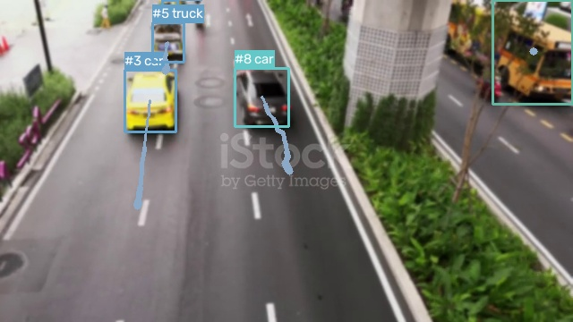

# YOLOv8 + DeepSORT Real-Time Object Tracking System

A real-time, high-performance object detection and tracking web application combining a **FastAPI (Python) backend** with a **React + TypeScript (Vite) frontend**. This project is optimized for speed, scalability, and clean modular code, making it an excellent resume piece.



---

## 🌟 Key Features
* **Real-time Webcam Tracking**: Captures browser webcam frames, streams them to the server, and renders annotated tracking results with persistent IDs in real-time.
* **Frame-by-Frame Video Tracking**: Upload any video file (e.g. `.mp4`); the system processes frames frame-by-frame using closed-loop synchronization to prevent lagging or skipping.
* **Subtle Motion Trails**: Renders clean, aesthetic trajectory history lines behind objects to show their paths. Can be toggled ON/OFF in real-time.
* **Object Class Filtering**: Select specific categories to track (e.g., track *only* vehicles, or *only* people) using checkbox filters in the dashboard.
* **Aesthetic Minimalistic UI**: A clean, responsive light-themed dashboard featuring real-time statistics (FPS, active track count, cumulative track count).

---

## 🛠️ System Architecture

The application uses a persistent **WebSocket connection** for bi-directional, low-latency communication.

```
┌─────────────────────────────────┐           ┌─────────────────────────────────┐
│        React Frontend           │           │         FastAPI Backend         │
│  - Captures Webcam/Video        │           │  - WebSocket Connection Handler │
│  - Downscales frames to 640px   ├──────────>│  - Base64 Frame Decoder         │
│  - Sends JPEG base64            │           │  - Runs YOLOv8 Object Detection │
│                                 │           │  - Updates DeepSORT Tracker     │
│  - Receives annotated frames    │<──────────┤  - Encodes annotated JPEG       │
│  - Renders tracking overlays    │           │  - Sends results (base64 + stats)│
└─────────────────────────────────┘           └─────────────────────────────────┘
```

---

## 🔬 Core Algorithms & Resume Concepts

* **YOLOv8 (Ultralytics)**: A state-of-the-art single-stage convolutional neural network that predicts object bounding boxes, class labels, and confidence scores in a single forward pass.
* **DeepSORT**:
  * **Kalman Filter**: Predicts the next state (position and velocity) of existing tracks using a linear constant-velocity model, ensuring track continuity during frames with missing detections.
  * **Hungarian Algorithm**: Solves the bipartite association problem, matching predicted Kalman filter states with new YOLOv8 detections using Mahalanobis distance and visual appearance features.
  * **MobileNet Visual Embedder**: Extracts a 512-dimension deep feature vector (visual embedding) of detected objects, allowing the system to re-identify objects and preserve their tracking IDs even after temporary occlusions.

---

## 🚀 Setup & Installation

### Prerequisites
* **Python 3.10+** (System verified with Python 3.13)
* **Node.js 18+** & **npm**

### 1. Backend Setup
1. Navigate to the backend directory:
   ```bash
   cd backend
   ```
2. Create and activate a virtual environment:
   ```bash
   python -m venv .venv
   # On Windows:
   .venv\Scripts\activate
   # On macOS/Linux:
   source .venv/bin/activate
   ```
3. Install dependencies:
   ```bash
   pip install -r requirements.txt
   ```
4. Run the FastAPI server:
   ```bash
   python main.py
   ```
   *(Server starts at `http://localhost:8000`)*

### 2. Frontend Setup
1. Navigate to the frontend directory:
   ```bash
   cd ../frontend
   ```
2. Install npm packages:
   ```bash
   npm install
   ```
3. Start the Vite dev server:
   ```bash
   npm run dev
   ```
   *(Open `http://localhost:5173` in your browser)*

---

## 📁 Repository Structure
```
├── backend/
│   ├── main.py            # FastAPI WebSocket server
│   ├── tracker.py         # YOLOv8 + DeepSORT tracker wrapper
│   ├── requirements.txt   # Python packages
│   └── test_detection.py  # Diagnostic test script
├── frontend/
│   ├── src/
│   │   ├── App.tsx        # React Dashboard & canvas loop
│   │   ├── index.css      # Minimalist light theme CSS
│   │   └── main.tsx       # Vite entry point
│   ├── package.json       # Node dependencies
│   └── vite.config.ts     # Vite configuration
└── assets/
    └── demo_tracking.jpg  # Demo snapshot for README
```
